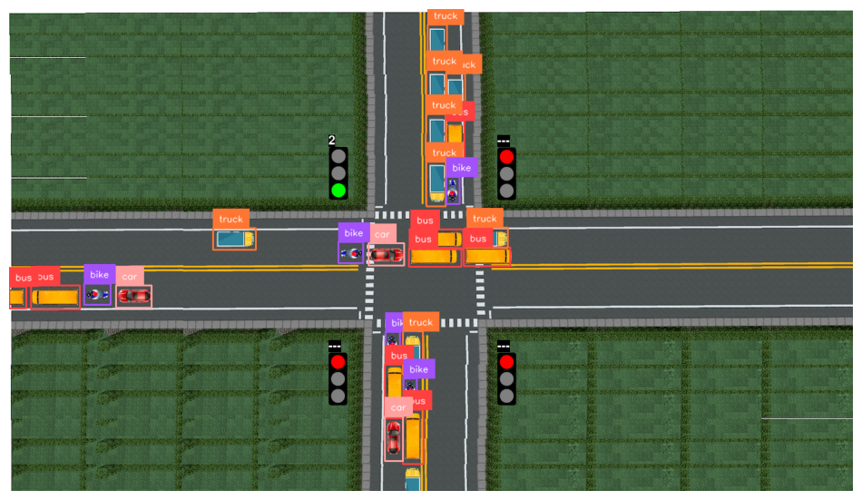

# Traffic Signal Simulation with AI Decision-Making

This project is a traffic signal simulation that uses AI to manage and optimize traffic flow. The simulation models traffic signals and vehicles at a four-way intersection, dynamically adjusting signal timing based on real-time vehicle counts using a pre-trained YOLO model and a generative AI model.

## Features

- **Real-time Traffic Signal Management**: Simulates traffic signals with default timing and adjusts based on real-time vehicle counts.
- **AI Decision-Making**: Uses Google Generative AI to decide the next traffic signal state based on vehicle counts.
- **YOLO Object Detection**: Utilizes YOLOv8 model for vehicle detection in the simulation.
- **Visual Simulation**: Renders a visual simulation of traffic signals and vehicle movement using Pygame.

## Requirements

- Python 3.x
- Pygame
- Google Generative AI
- Ultralytics YOLO
- OpenCV
- Matplotlib
- Torch

## Installation

1. Clone the repository:
   ```bash
   git clone https://github.com/your_username/traffic-signal-simulation.git
   cd traffic-signal-simulation
2. Install the required libraries:
   ```bash
   pip install pygame google-generativeai ultralytics opencv-python matplotlib torch
3. Configure the Google Generative AI API key:
Replace YOUR_API_KEY in the code with your actual API key.
   ```bash
   genai.configure(api_key="YOUR_API_KEY")

## Usage
1. Run the simulation:
   ```bash
   python main.py
2. The simulation window will open, showing the intersection with traffic signals and moving vehicles.

## Example Simulation

Below is a sample output from the simulation:



[Watch Simulation Video](simulation-video.mp4)

## License
This project is licensed under the MIT License. See the LICENSE file for more details.

## Contributing
Contributions are welcome! Please open an issue or submit a pull request for any improvements or bug fixes.

## Contact
For any questions or feedback, please contact tayyabuetm24@gmail.com
